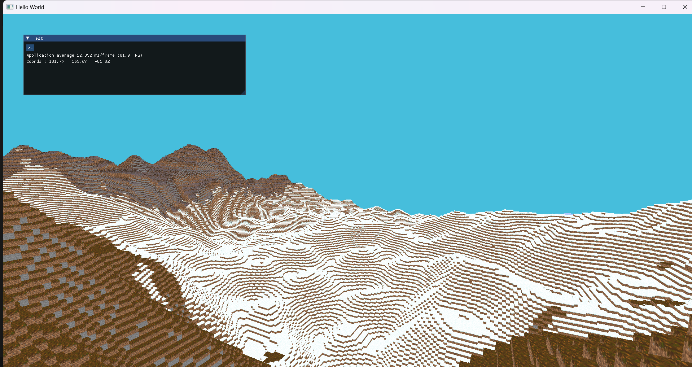

# Voxel Engine (C++ / OpenGL)

## Overview

This is a C++ voxel engine (Minecraft-like) developed as a personal project to explore:

- real-time rendering
- procedural generation
- engine architecture
- performance optimization (CPU & GPU)

The project uses modern C++ with OpenGL and includes ImGui for debugging tools.

---

## Showcase

> Voronoi-based biome system with smooth transitions and adaptive terrain generation

---

## Background

This project started after following The Cherno OpenGL series:  
https://www.youtube.com/watch?v=W3gAzLwfIP0&list=PLlrATfBNZ98foTJPJ_Ev03o2oq3-GGOS2

It evolved from a learning project into a fully custom voxel engine featuring:

- chunk streaming
- multithreaded mesh generation
- procedural terrain & biome systems
- performance-focused architecture

---

## Tech Stack

- C++ (C++17/20)
- OpenGL
- GLSL shaders
- ImGui
- GLM

---

## Features

### World System
- Chunk-based world streaming
- Dynamic loading/unloading around player
- Seamless chunk borders

### Rendering
- Separate pipelines:
  - opaque geometry
  - transparent geometry
- Texture atlas
- Frustum culling

### Voxel System
- Full 3D voxel grid
- Face culling (only visible faces generated)
- Neighbor-aware meshing

### Multithreading
- Worker thread pool for chunk meshing
- Thread-safe job system
- Asynchronous mesh generation

---

## Procedural Generation

### Terrain
- Perlin noise-based heightmap
- Tuned frequencies & amplitudes for natural terrain

### Biomes (NEW)
- Voronoi-based biome distribution
- Smooth blending between up to 4 biomes
- Removal of Perlin "value continuity" limitation
- More natural large-scale biome regions

### Biome Blending
- Multi-biome weight system
- Noise-based border perturbation for organic transitions

---

## Architecture

### Main Thread
- Chunk management (load/unload)
- Rendering (OpenGL)
- GPU buffer updates

### Worker Threads
- Chunk mesh generation
- Voxel → mesh conversion

### Chunk Rendering
Each chunk contains:
- CPU voxel data
- GPU buffers:
  - opaque mesh
  - transparent mesh

→ ~2 draw calls per chunk

---

## Performance

### Current
- ~70–90 FPS stable
- ~80 FPS in heavy biome transitions

### Previous
- ~20 FPS (before optimizations)

### Improvements
- Frustum culling
- Multithreaded meshing
- Controlled mesh generation per frame

---

## Current Bottlenecks

GPU-bound:

- high vertex count per chunk
- many draw calls
- no LOD system

---

## Limitations

- No lighting system yet
- No LOD
- Greedy meshing not retained (cost > benefit)
- GPU optimization still in progress

---

## Future Work

- Vegetation system (trees, foliage)
- Lighting (sun + block light)
- LOD system
- GPU optimizations (instancing / vertex pulling)
- Procedural trees (seed-based generation)
- Advanced biome system

---

## Design Notes

- Perlin noise is used for terrain (continuous, smooth)
- Voronoi noise is used for biome partitioning (discrete regions)
- Engine focus has shifted:
  
> CPU optimization → GPU optimization
